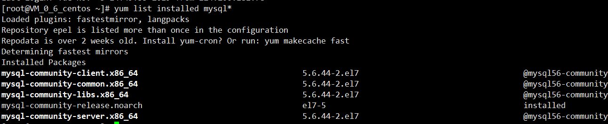
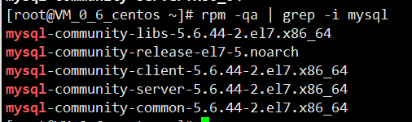

# CentOS7 卸载 MySQL（yum 源方式）

## yum 方式

- 检查是否安装

```bash
yum list installed mysql*
```

> 如下图所示 即为安装

<p style="text-align:center;">
  
</p>

- yum 卸载

> 根据上图列表中的名字

```bash
yum remove mysql-community-client.x86_64 mysql-community-common.x86_64 ...
rm -rf /var/lib/mysql
rm /etc/my.cnf
```

## rpm 方式

- 查看是否安装

```bash
rpm -qa | grep -i mysql
```

> 如下图所示

<p style="text-align:center;">
  
</p>
- 卸载

```bash
rpm -e mysql57-community-release-el7-9.noarch
rpm -e mysql-community-server-5.7.17-1.el7.x86_64
rpm -e mysql-community-libs-5.7.17-1.el7.x86_64
rpm -e mysql-community-libs-compat-5.7.17-1.el7.x86_64
rpm -e mysql-community-common-5.7.17-1.el7.x86_64
rpm -e mysql-community-client-5.7.17-1.el7.x86_64
cd /var/lib/
rm -rf mysql/
```

## 清除其他

```bash
whereis mysql
mysql: /usr/bin/mysql /usr/lib64/mysql /usr/local/mysql /usr/share/mysql /usr/share/man/man1/mysql.1.gz
#删除上面的文件夹
rm -rf /usr/bin/mysql
```

- 删除配置

```bash
rm –rf /usr/my.cnf
rm -rf /root/.mysql_sercret
```

- 剩余配置检查

```bash
# 检查
chkconfig --list | grep -i mysql

# 删除检查结果
chkconfig --del mysqld
```
