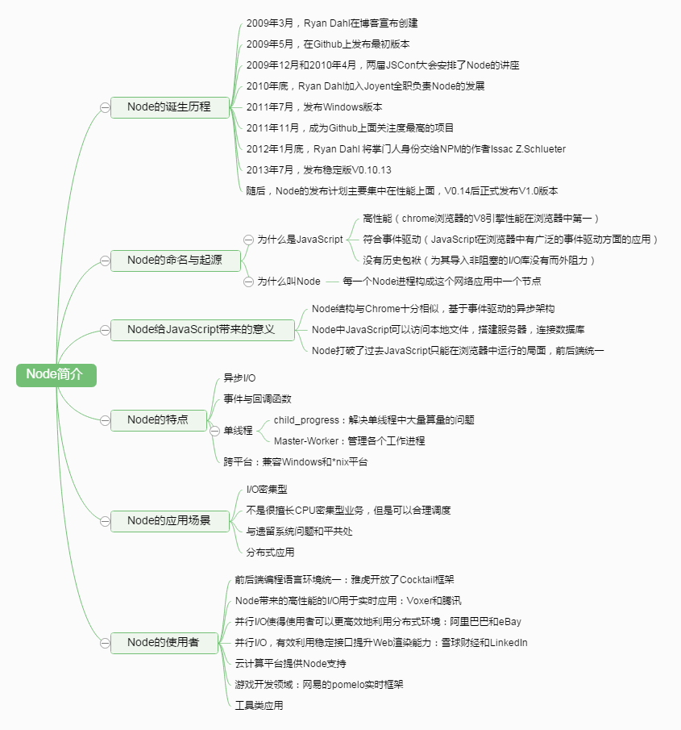
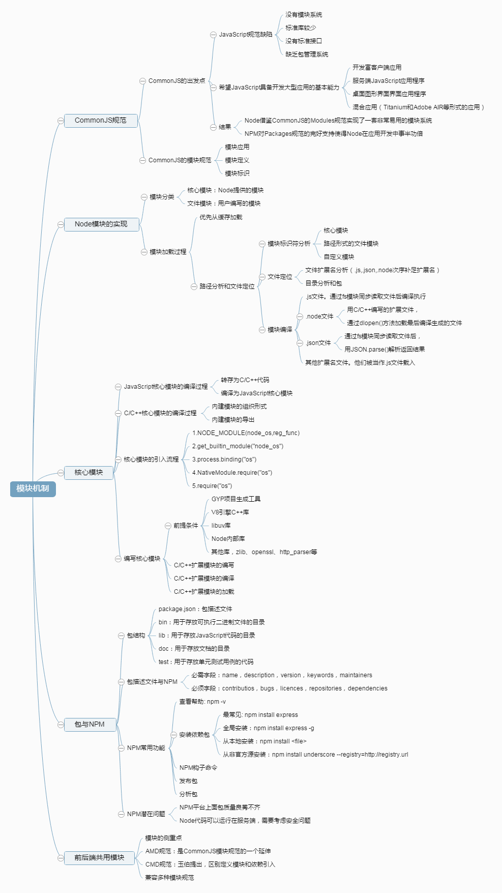
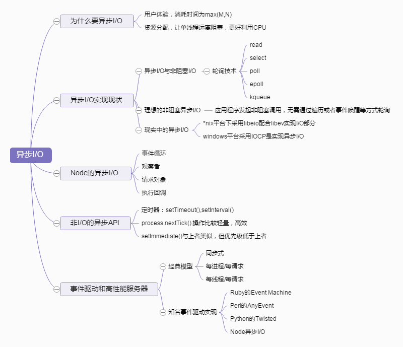
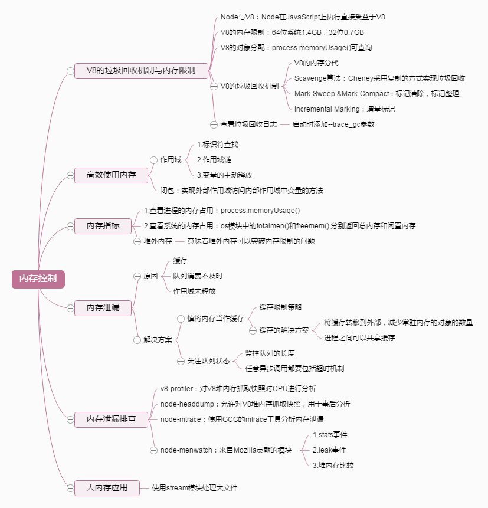
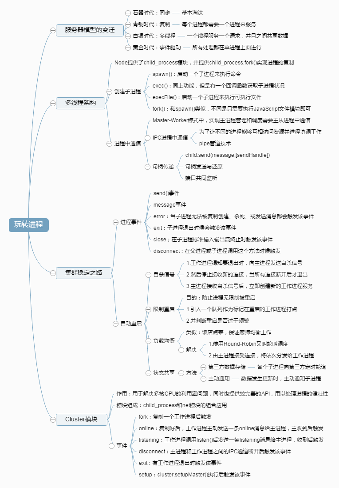
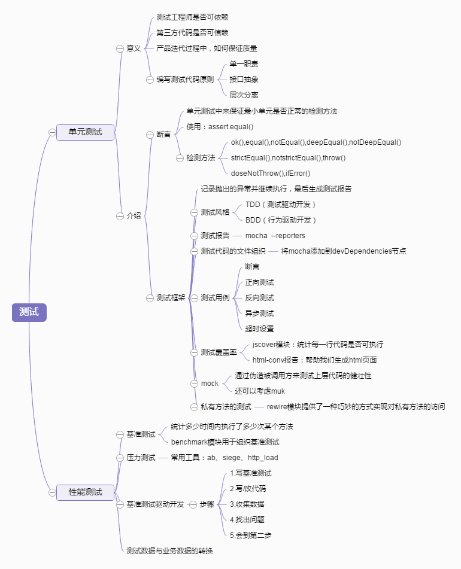
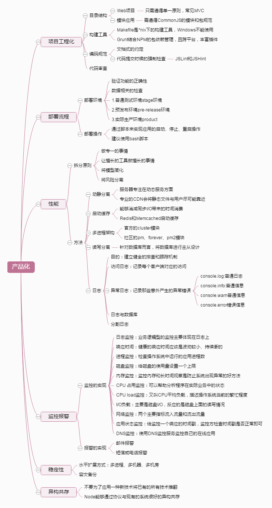

# Node.js 开发图谱

## Node.js 简介

  

## Node.js 模块机制

  

## Node.js 异步 io

  

## Node.js 异步编程

  

## Node.js 内存控制

  

## Node.js Buffer

  

## Node.js 网络编程

  

## Node.js 构建 web 应用

  

## Node.js 进程

  

## Node.js 应用测试

  

## Node.js 产品化

  

