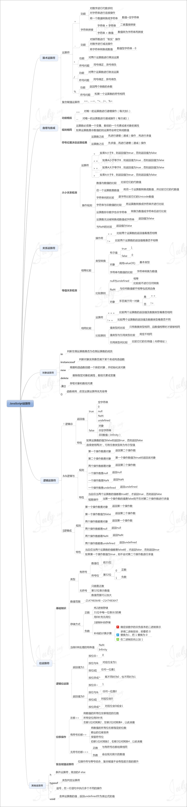

# 前端开发图谱

## JavaScript 变量

  

## JavaScript 数据类型

  

## JavaScript 运算符

  

## JavaScript 字符串

  

## JavaScript 流程控制

  

## JavaScript 数组

  

## JavaScript 函数

  

## JavaScript 浏览器对象

  

## JavaScript DOM 操作

  

## JavaScript 正则表达式

  

